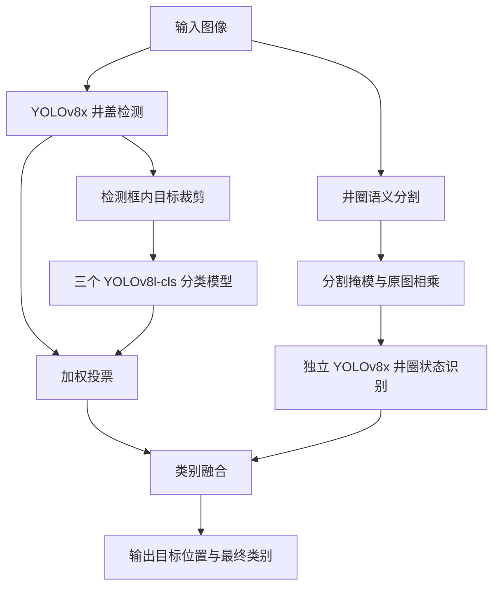

# 井盖隐患智能识别

**融合目标检测、井圈分割与集成分类的井盖状态识别方案**

本项目面向室外巡检场景，利用图像识别辅助发现井盖破损、缺失、未盖及井圈异常等安全隐患。项目由 **Star Rail 团队（编号 2400089）**围绕 **【A03】井盖隐患智能识别**赛题开展，仓库收录算法源码、项目报告、演示前端压缩包和演示视频。

[项目介绍][report] · [项目概要][summary] · [演示视频][video] · [演示前端压缩包][demo]

> 本仓库是项目源码与竞赛材料归档。下文技术方案和实验结果依据原项目文档整理；当前上传内容尚不足以直接复现完整系统，具体条件见「运行与复现」。

## 项目思路

井盖识别的困难不仅在于定位目标，还包括井盖与井圈边界不清、同类目标外观差异大、样本数量不均衡以及标注误差。项目将井盖和井圈分开处理，再融合各分支结果：

- **数据补充与标注**：结合官方数据、网络采集与 Stable Diffusion 生成图片，进行人工筛选；使用 LabelImg 标注检测框，使用 LabelMe 标注井圈分割区域。
- **井盖检测**：采用 YOLOv8x 定位井盖，并初步判断四类井盖状态。
- **井圈分割与识别**：文档提出基于 PVTv2-B2 与 Swin Transformer 的 U 型分割方案，通过掩模提取井圈区域，再使用独立 YOLOv8x 模型识别井圈状态。
- **集成分类**：通过自助采样训练三个 YOLOv8l-cls 分类模型，将分类结果与检测分支结果加权投票，以减少单一模型误判。

## 识别类别

| 标签 | 含义 |
| --- | --- |
| `good` | 井盖完好 |
| `broke` | 井盖破损 |
| `lose` | 井盖缺失 |
| `uncovered` | 井盖未盖 |
| `circle` | 井圈存在问题 |

训练时，井盖分支使用前四类标签；井圈分支单独区分 `circle-good` 与 `circle-problem`。最终输出按项目分类规则融合为五类。

## 技术流程

以下为原项目文档描述的方案流程，不代表仓库已提供统一推理入口。



**投票权重**：检测模型预测占 3 票，三个分类模型分别占 1 票。

原文对井圈优先级的描述存在差异：前文强调井圈问题优先，后文具体描述了“井盖完好且井圈异常时归为 `circle`”。当前未找到完整的融合入口，复现时需要先明确冲突类别和投票平局的处理规则。

## 实验记录

以下数据来自[项目介绍][report]第 5 节，**未在当前仓库环境重新训练或评测**。

| 数据划分 | 图片数量 |
| --- | ---: |
| 训练集 | 1,508 |
| 验证集 | 167 |
| 官方测试集 | 350 |

文档记录的实验环境为 Ubuntu 20.04 LTS、Python 3.8 和双 NVIDIA GeForce RTX 3090，使用 CUDA 进行数据并行训练。

| 指标 / 类别 | 文档报告值 |
| --- | ---: |
| all mAP | 0.8102 |
| good | 0.9364 |
| broke | 0.9737 |
| lose | 0.9420 |
| uncovered | 0.9905 |
| circle | 0.2083 |

原表未明确该组数值对应的 IoU 阈值口径及评测数据划分，因此不将其标注为 `mAP@0.5` 或 `mAP@0.5:0.95`。井圈类别的报告值明显低于其他类别，是后续改进的重点。

## 仓库结构

```text
.
├── README.md
├── LICENSE
└── 2400089-Star Rail-【A03】井盖隐患智能识别 (1)/
    ├── 源码/
    │   ├── SAE_lvbo/SAE_lvbo/
    │   │   ├── MyTrain.py       # 分割模型训练入口
    │   │   ├── MyTest.py        # 分割模型预测入口
    │   │   ├── MyEval.py        # 评估入口
    │   │   ├── lib/            # 网络结构
    │   │   ├── utils/          # 数据读取等工具
    │   │   └── requirements.txt
    │   └── ultralytics/        # Ultralytics 源码、配置与文档
    ├── …-文档整合/             # 项目介绍、概要、PPT 和视频
    ├── …-其他材料/             # 演示前端 ZIP 和视频
    └── …-项目演示视频.mp4
```

本地虚拟环境、Python 缓存和编辑器配置不纳入版本控制。

## 运行与复现

### 获取项目

```bash
git clone https://github.com/Swordmynew/well_cover-master.git
cd well_cover-master
```

### 算法源码

- [Ultralytics 子项目][yolo]提供检测、分类等框架代码，安装配置见其 `pyproject.toml`，使用说明见子项目 README。
- [SAE 子项目][sae]提供分割网络、训练、预测与评估脚本。源码使用 PyTorch，包含 PVTv2、Swin Transformer 等网络实现；依赖记录见 `requirements.txt`。

开始训练或推理前，需要完成以下准备：

1. **补齐项目数据与模型权重**：当前已展开源码目录未附带井盖训练数据、训练完成的 `.pt` / `.pth` 权重以及完整的业务推理配置。
2. **核对依赖环境**：SAE 原 README 写的是 Python 3.6，项目报告写的是 Python 3.8，依赖清单还包含不同年代的固定版本。这些记录尚未整理为经验证可安装的统一环境。
3. **修改路径与设备配置**：`run.sh`、`test.sh`、`eval.sh` 及部分 Python 脚本保留了原机器的绝对路径、`DGNet` 环境名和 GPU 编号。训练与预测代码直接调用 CUDA，不能假定可在纯 CPU 环境运行。
4. **核对模型配置与融合逻辑**：现有启动脚本使用 `EF-B4`，与报告所述 PVTv2-B2 / Swin 方案不同；完整分类投票与井圈结果融合入口仍需补齐或确认。

因此，此处不提供未经验证的一键训练或完整推理命令。SAE 原 README 中的外部数据链接也不能直接视为本项目井盖数据集。

### 演示前端

[项目演示 Demo 压缩包][demo]内包含 `jinggai_frontend-master/`，使用 **Vue 3、Vite 4、PrimeVue 和 Axios**。解压后进入该目录，可按其 `package.json` 中的脚本启动：

```bash
cd jinggai_frontend-master
npm install
npm run dev
```

开发脚本指定端口为 `4453`。构建命令为：

```bash
npm run build
```

前端在线检测页面请求 `http://127.0.0.1:8000/api/detects`，连通性页面请求 `/ping`。当前材料中未找到与这些接口配套的后端服务，启动前端本身不代表能够完成模型检测。上述命令依据压缩包配置整理，本次未实际安装依赖或构建。

## 文档与演示

| 材料 | 内容 |
| --- | --- |
| [项目介绍 PDF][report] | 方案背景、技术路线、实验设定与结果 |
| [项目概要 PDF][summary] | 项目特色、功能与应用场景 |
| [项目简介 PPT][slides] | 汇报展示材料 |
| [项目演示视频][video] | 系统演示记录 |
| [数据上传视频][uploadvideo] | 数据上传流程演示 |
| [项目演示 Demo 压缩包][demo] | Vue 前端源码与演示资源 |

## 许可证

仓库根目录保留原有 [MIT License](LICENSE)。第三方组件遵循各自附带的许可证；[Ultralytics 许可证][yololicense]为 AGPL-3.0，根目录 MIT 许可证不替代该子项目的许可条款。

[report]: 2400089-Star%20Rail-%E3%80%90A03%E3%80%91%E4%BA%95%E7%9B%96%E9%9A%90%E6%82%A3%E6%99%BA%E8%83%BD%E8%AF%86%E5%88%AB%20%281%29/2400089-Star%20Rail-%E3%80%90A03%E3%80%91%E4%BA%95%E7%9B%96%E9%9A%90%E6%82%A3%E6%99%BA%E8%83%BD%E8%AF%86%E5%88%AB-%E6%96%87%E6%A1%A3%E6%95%B4%E5%90%88/2400089-Star%20Rail-%E3%80%90A03%E3%80%91%E4%BA%95%E7%9B%96%E9%9A%90%E6%82%A3%E6%99%BA%E8%83%BD%E8%AF%86%E5%88%AB-%E9%A1%B9%E7%9B%AE%E4%BB%8B%E7%BB%8D.pdf
[summary]: 2400089-Star%20Rail-%E3%80%90A03%E3%80%91%E4%BA%95%E7%9B%96%E9%9A%90%E6%82%A3%E6%99%BA%E8%83%BD%E8%AF%86%E5%88%AB%20%281%29/2400089-Star%20Rail-%E3%80%90A03%E3%80%91%E4%BA%95%E7%9B%96%E9%9A%90%E6%82%A3%E6%99%BA%E8%83%BD%E8%AF%86%E5%88%AB-%E6%96%87%E6%A1%A3%E6%95%B4%E5%90%88/2400089-Star%20Rail-%E3%80%90A03%E3%80%91%E4%BA%95%E7%9B%96%E9%9A%90%E6%82%A3%E6%99%BA%E8%83%BD%E8%AF%86%E5%88%AB-%E9%A1%B9%E7%9B%AE%E6%A6%82%E8%A6%81%E4%BB%8B%E7%BB%8D%20.pdf
[slides]: 2400089-Star%20Rail-%E3%80%90A03%E3%80%91%E4%BA%95%E7%9B%96%E9%9A%90%E6%82%A3%E6%99%BA%E8%83%BD%E8%AF%86%E5%88%AB%20%281%29/2400089-Star%20Rail-%E3%80%90A03%E3%80%91%E4%BA%95%E7%9B%96%E9%9A%90%E6%82%A3%E6%99%BA%E8%83%BD%E8%AF%86%E5%88%AB-%E6%96%87%E6%A1%A3%E6%95%B4%E5%90%88/2400089-Star%20Rail-%E3%80%90A03%E3%80%91%E4%BA%95%E7%9B%96%E9%9A%90%E6%82%A3%E6%99%BA%E8%83%BD%E8%AF%86%E5%88%AB-%E9%A1%B9%E7%9B%AE%E7%AE%80%E4%BB%8BPPT.pptx
[video]: 2400089-Star%20Rail-%E3%80%90A03%E3%80%91%E4%BA%95%E7%9B%96%E9%9A%90%E6%82%A3%E6%99%BA%E8%83%BD%E8%AF%86%E5%88%AB%20%281%29/2400089-Star%20Rail-%E3%80%90A03%E3%80%91%E4%BA%95%E7%9B%96%E9%9A%90%E6%82%A3%E6%99%BA%E8%83%BD%E8%AF%86%E5%88%AB-%E9%A1%B9%E7%9B%AE%E6%BC%94%E7%A4%BA%E8%A7%86%E9%A2%91.mp4
[uploadvideo]: 2400089-Star%20Rail-%E3%80%90A03%E3%80%91%E4%BA%95%E7%9B%96%E9%9A%90%E6%82%A3%E6%99%BA%E8%83%BD%E8%AF%86%E5%88%AB%20%281%29/2400089-Star%20Rail-%E3%80%90A03%E3%80%91%E4%BA%95%E7%9B%96%E9%9A%90%E6%82%A3%E6%99%BA%E8%83%BD%E8%AF%86%E5%88%AB-%E5%85%B6%E4%BB%96%E6%9D%90%E6%96%99/2400089-Star%20Rail-%E3%80%90A03%E3%80%91%E4%BA%95%E7%9B%96%E9%9A%90%E6%82%A3%E6%99%BA%E8%83%BD%E8%AF%86%E5%88%AB-%E6%95%B0%E6%8D%AE%E4%B8%8A%E4%BC%A0%E8%A7%86%E9%A2%91.mp4
[demo]: 2400089-Star%20Rail-%E3%80%90A03%E3%80%91%E4%BA%95%E7%9B%96%E9%9A%90%E6%82%A3%E6%99%BA%E8%83%BD%E8%AF%86%E5%88%AB%20%281%29/2400089-Star%20Rail-%E3%80%90A03%E3%80%91%E4%BA%95%E7%9B%96%E9%9A%90%E6%82%A3%E6%99%BA%E8%83%BD%E8%AF%86%E5%88%AB-%E5%85%B6%E4%BB%96%E6%9D%90%E6%96%99/2400089-Star%20Rail-%E3%80%90A03%E3%80%91%E4%BA%95%E7%9B%96%E9%9A%90%E6%82%A3%E6%99%BA%E8%83%BD%E8%AF%86%E5%88%AB-%E9%A1%B9%E7%9B%AE%E6%BC%94%E7%A4%BADemo.zip
[yolo]: 2400089-Star%20Rail-%E3%80%90A03%E3%80%91%E4%BA%95%E7%9B%96%E9%9A%90%E6%82%A3%E6%99%BA%E8%83%BD%E8%AF%86%E5%88%AB%20%281%29/%E6%BA%90%E7%A0%81/ultralytics
[sae]: 2400089-Star%20Rail-%E3%80%90A03%E3%80%91%E4%BA%95%E7%9B%96%E9%9A%90%E6%82%A3%E6%99%BA%E8%83%BD%E8%AF%86%E5%88%AB%20%281%29/%E6%BA%90%E7%A0%81/SAE_lvbo/SAE_lvbo
[yololicense]: 2400089-Star%20Rail-%E3%80%90A03%E3%80%91%E4%BA%95%E7%9B%96%E9%9A%90%E6%82%A3%E6%99%BA%E8%83%BD%E8%AF%86%E5%88%AB%20%281%29/%E6%BA%90%E7%A0%81/ultralytics/LICENSE
